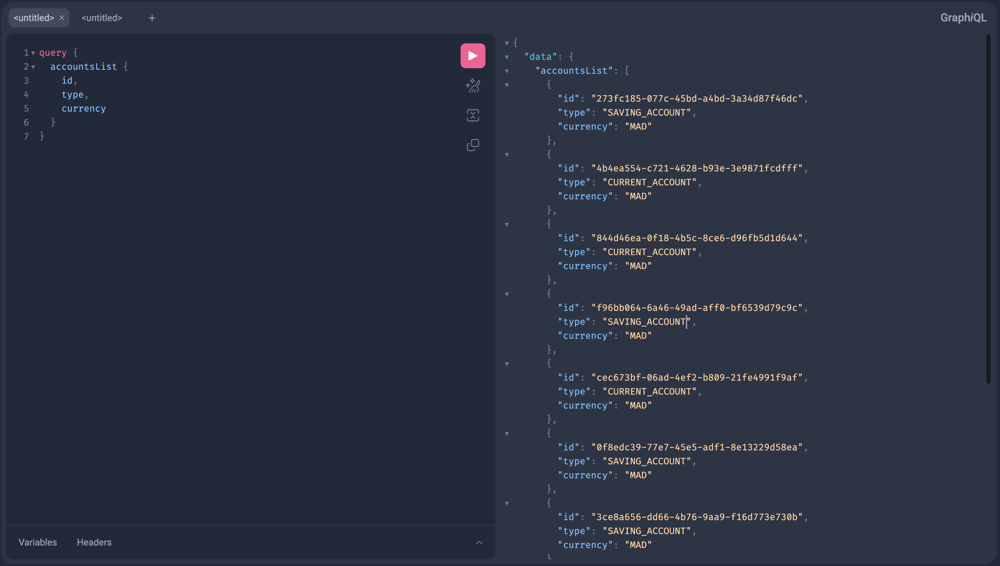
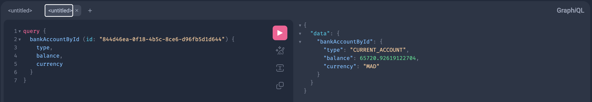
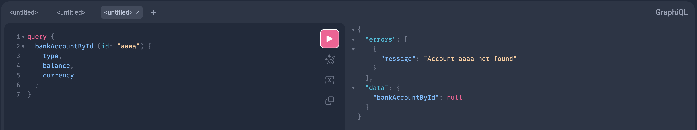
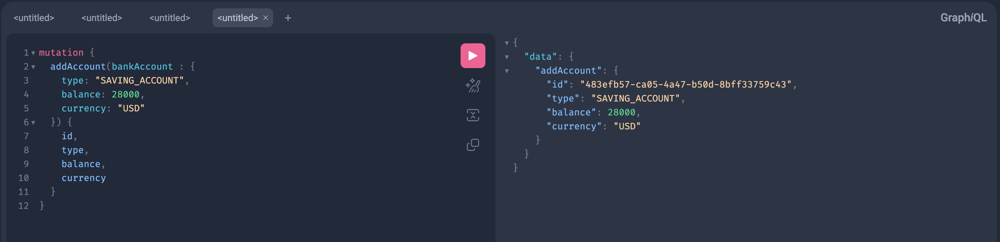
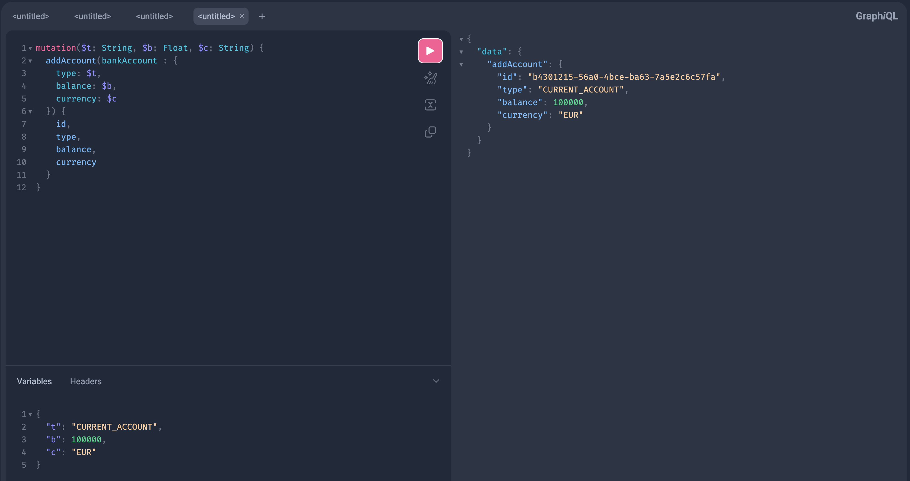
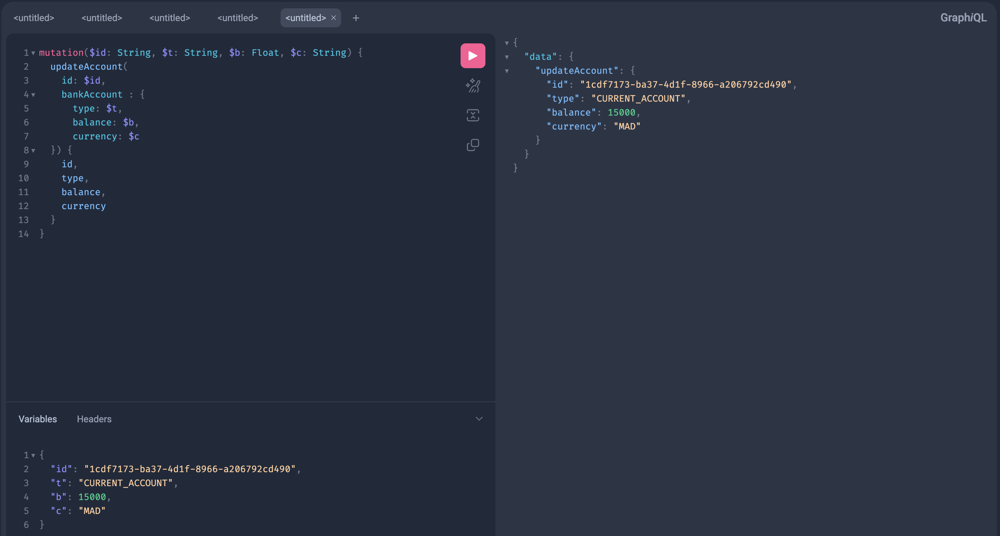
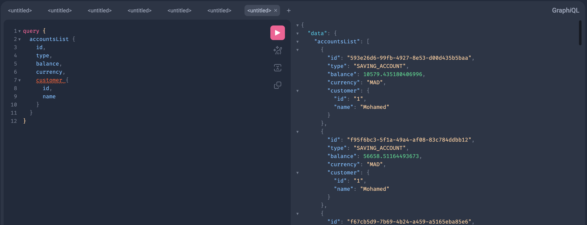
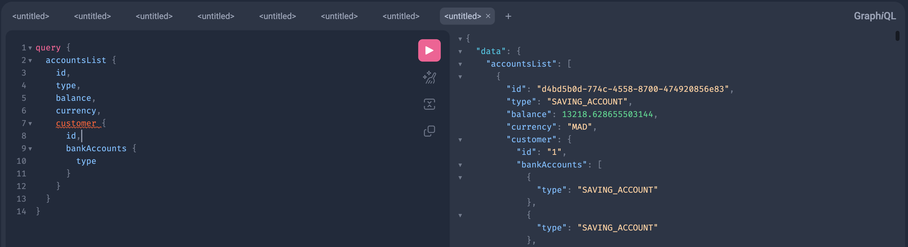

# Account Service

### screenshots
- récupération de tous les comptes avec id, type, currency

- récupération d'un compte avec type, balance, currency

- compte non trouvé

- ajout d'un compte

- ajouter un compte en utilisant des paramètres

- mettre à jour un compte bancaire avec paramètres

- compte client dans la list des comptes bancaires

- comptes clients avec leurs comptes bancaires dans la liste des comptes bancaires
